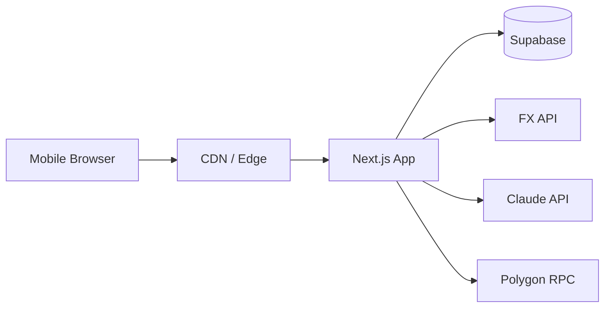

# SwiftX Architecture

This document captures the system architecture for SwiftX: components, data flow, integrations, and the trust model.

## Goals

- Zero-fee remittances through internal wallet transfers and multi-currency pools.
- Transparent, verifiable ledger using a hash chain with optional Polygon anchoring.
- Mobile-first UX with PWA installability and fast page loads.
- AI-powered insights and compliance-ready audit trails.

## System Overview

```mermaid
graph TB
  subgraph Client[Client (PWA)]
    UI[Next.js App Router UI]
    PWA[PWA Shell + Manifest]
  end

  subgraph App[Next.js Server]
    API[API Routes]
    SA[Server Actions]
    MW[Middleware]
    FX[FX Service]
    AML[AML Rules Engine]
    CH[Hash Chain Logic]
    AI[AI Insights Service]
    AN[Polygon Anchor Service]
  end

  subgraph Data[Data Layer]
    SB[(Supabase Postgres)]
    RLS[RLS Policies]
  end

  subgraph External[External Services]
    FXAPI[exchangerate.host]
    CLAUDE[Anthropic Claude API]
    POLY[Polygon Amoy]
  end

  UI --> API
  UI --> SA
  PWA --> UI
  MW --> UI

  API --> FX
  API --> AML
  API --> CH
  API --> AI
  API --> AN

  FX --> FXAPI
  AI --> CLAUDE
  AN --> POLY

  API --> SB
  SA --> SB
  SB --> RLS
```

## Architecture Layers

### Client (PWA)

- Next.js App Router UI with mobile-first layouts and a max-width frame.
- Installable PWA using the manifest in public/manifest.json.
- Routes under app/ organized by auth, app, and admin groups.

### App Server (Next.js)

- API routes handle server-side operations for transfer, FX, insights, and anchoring.
- Middleware protects app routes and enforces auth.
- Shared business logic in lib/ is used by both UI and API routes.

### Data Layer (Supabase Postgres)

- Profiles, wallets, transactions, FX cache, AML flags, and anchor tables.
- RLS policies ensure users can only access their own data.

### External Services

- FX rate provider (exchangerate.host) with server-side caching.
- Claude API for personalized insights.
- Polygon Amoy for periodic anchoring of hash chain roots.

## Key Components

### Transaction Ledger (Hash Chain)

- Each transaction includes prev_hash and current_hash fields.
- current_hash is computed from deterministic transaction fields + prev_hash.
- Verification walks the chain and ensures hashes match and link correctly.
- Optional Polygon anchoring stores the chain root periodically.

### Transfer Flow

1. Get FX rate from cache or external API.
2. Resolve wallets for sender and recipient (auto-create on demand).
3. Run AML checks on the transfer parameters.
4. Execute atomic transfer via Supabase RPC.
5. Compute and store current_hash for the transaction.

### FX Service

- Hourly cache in fx_rates_cache.
- Small margin (spread) applied to user-facing rate.
- Fallback to last cached rate if external API fails.

### AML Rules Engine

- Rules: amount threshold, velocity checks, and risk heuristics.
- Flags written to aml_flags for audit and admin review.

### AI Insights

- Pull recent transactions and profile context.
- Generate short, localized tips using Claude.
- Keep responses brief for in-app card UI.

### Polygon Anchoring

- Anchor the latest hash chain root every N transactions.
- Store tx hash in polygon_anchors for public auditability.

## Data Model Summary

- profiles: user metadata and KYC status.
- wallets: per-user balances by currency.
- transactions: hash-chained ledger entries.
- fx_rates_cache: hourly rate snapshots.
- aml_flags: compliance and risk flags.
- polygon_anchors: on-chain anchor references.

## Key API Routes

- POST /api/transfer: executes wallet-to-wallet transfer.
- GET /api/fx: returns a cached or live FX rate.
- POST /api/insights: generates an AI insight card.
- POST /api/anchor: anchors latest chain root to Polygon.
- GET /api/verify-chain: validates hash chain integrity.

## Security and Compliance

- Supabase Auth with RLS for row-level isolation.
- Server-side secrets for Claude API and Polygon RPC.
- AML flags + admin dashboard for compliance visibility.
- Hash chain + optional Polygon anchoring for tamper evidence.

## Deployment Topology



## Configuration Notes

Required env vars (see .env.local.example):

- NEXT_PUBLIC_SUPABASE_URL
- NEXT_PUBLIC_SUPABASE_ANON_KEY
- SUPABASE_SERVICE_ROLE_KEY
- ANTHROPIC_API_KEY
- POLYGON_AMOY_RPC
- POLYGON_PRIVATE_KEY
- LEDGER_ANCHOR_CONTRACT

## Operational Concerns

- Cache FX rates to reduce external API dependency.
- Anchor chain hashes in batches to reduce gas usage.
- Monitor Supabase RLS regressions with two-user tests.
- Keep AI prompts short and deterministic for UI fit.
